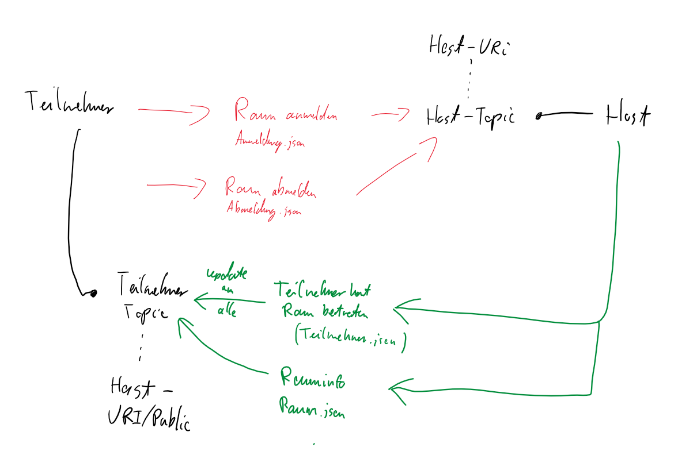

# Messaging
Für den Nachrichtenaustausch werden json-files als messages gesendet. Teilnehmer und Host senden auf zwei unterschiedlichen topics verschiedene Steuernachrichten.

# Skizze

# Topics
Es gibt pro Raum jeweils ein:
* hosttopic
* participant-topic

**hosttopic**

Hier werden alle Nachrichten von Teilnehmern an den Host übermittelt.

Es hat den Aufbau: `20moagm/<uri>`

**participant-topic**

Hier werden alle Nachrichten von dem Host an die Teilnehmer übermittelt.

Es hat den Aufbau: `20moagm/<uri>/public`

# JSONs/Nachrichten
Es gibt die JSON-Files/message-arten:
* anmeldung.json
* abmeldung.json
* teilnehmer.json
* rauminfo.json

## anmeldung.json

**Beschreibung**

Eine Anmeldung wird auf das host-topic gesendet, also an den host. Sie wird gesendet wenn ein Teilnehmer sich per mqtt-service auf ein topic connected.

**Inhalt**

Eine anmeldung.json enthält die Felder:
* teilnehmer
* entertime

**teilnehmer**

Hier steht das MySelf des Teilnehmers als String oder in anderer serialisierter Form.

**entertime**

Das ist die Zeit zu der der Teilnehmer den Raum betritt.

## abmeldung.json

**Beschreibung**

Eine Abmeldung wird auf das host-topic gesendet, also an den host. Sie wird gesendet wenn ein Teilnehmer sich per mqtt-service von einem topic disconnected. 

**Inhalt**

Eine abmeldung.json enthält die Felder:
* teilnehmer
* exittime

**teilnehmer**

Hier steht das MySelf des Teilnehmers als String oder in anderer serialisierter Form

**exittime**

Das ist die Zeit zu der der Teilnehmer den Raum verlässt.

## teilnehmer.json
**Beschreibung**:

Eine Teilnehmer.json wird auf das participant-topic gesendet, also an den participant. 

Sie wird gesendet wenn sich ein neuer Teilnehmer an einen Raum angemeldet hat. 
Der Host wartet auf ein Anmeldung.json. Erhält er es trägt er den Teilnehmer in die Datenbank ein und sendet ein Teilnehmer.json damit die anderen Teilnehmer um die Anmeldung des neuen Teilnehmers bescheid wissen.

**Inhalt**

Eine anmeldung.json enthält das Feld:
* Teilnehmerliste

**Teilnehmerliste**

In der Teilnehmerliste stehen alle Teilnehmer des aktuellen Raums drin.

## rauminfo.json
**Beschreibung**

Eine Teilnehmer.json wird auf das participant-topic gesendet, also an den participant.
Sie wird gesendet wenn sich die Umstände des Raumes ändern.
Datunter zählen:
* neues Timeout
* raumstatus hat sich von offen auf geschlossen oder vice versa geändert

**Inhalt**

Eine anmeldung.json enthält das Feld:
* Raum

**Raum**

Im Feld Raum steht die aktuelle Fassung des Raumes.